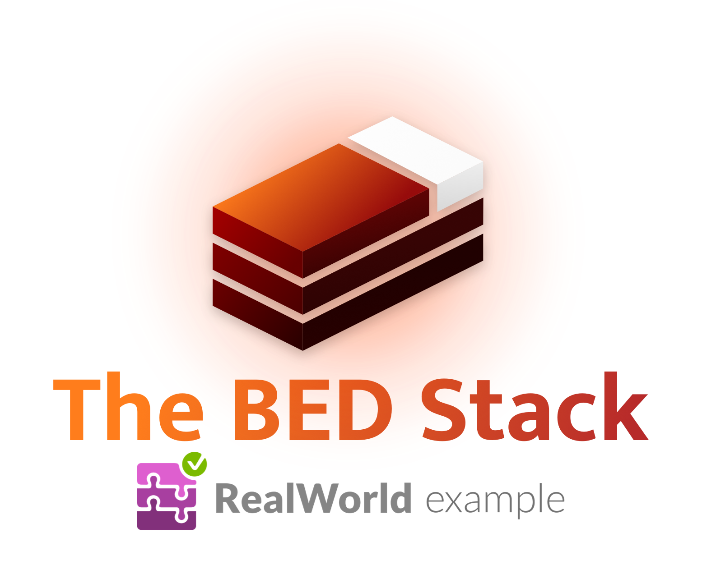

# 

> ### [ElysiaJS](https://elysiajs.com/) codebase containing real world examples (CRUD, auth, advanced patterns, etc) that adheres to the [RealWorld](https://github.com/gothinkster/realworld) spec and API.


### [Demo](https://demo.realworld.io/)&nbsp;&nbsp;&nbsp;&nbsp;[RealWorld](https://github.com/gothinkster/realworld)


This codebase was created to demonstrate a fully fledged backend application built with **Bun, ElysiaJS, and DrizzleORM** including CRUD operations, authentication, routing, pagination, and more.

We've gone to great lengths to adhere to the **Bun, ElysiaJS, and DrizzleORM** community styleguides & best practices.

For more information on how to this works with other frontends/backends, head over to the [RealWorld](https://github.com/gothinkster/realworld) repo.


# How it works

The application uses [ElysiaJS](https://elysiajs.com/) framework to implement the [backend API](https://realworld-docs.netlify.app/docs/specs/backend-specs/introduction) outlined in the [RealWorld docs](https://realworld-docs.netlify.app/).

It relies on [Postgres.js](https://github.com/porsager/postgres) to store data, and interacts with it through [DrizzleORM](https://orm.drizzle.team/docs/quick-postgresql/postgresjs).

The runtime is [Bun](https://bun.sh/) and the code is written in [TypeScript](https://www.typescriptlang.org/).

# Documentation

Check out our documentation by visiting https://agnyz.github.io/elysia-realworld-example-app.

# Getting started

> [!NOTE]
> This project includes support for [Dev Containers](https://code.visualstudio.com/docs/remote/containers) in VSCode. Read more about it in [Developing in a Dev Container in the docs](https://agnyz.github.io/elysia-realworld-example-app/dev-container.html).

1. **Clone and install dependencies**

    ```sh
    gh repo clone agnyz/elysia-realworld-example-app
    cd elysia-realworld-example-app
    bun i
    ```

2. **Ensure Docker daemon is running and spin up the Postgres+Bun container**

    ```sh
    bun up
    ```
3. **Migrate the schema to the database**

    ```sh
    bun db:migrate
    ```

4. **Run the app**

    ```sh
    bun dev
    ```

# Contributing

See [Contributing Guide](CONTRIBUTING.md).

# License

[MIT](LICENSE) License © 2023 Agnyz Technologies FC
